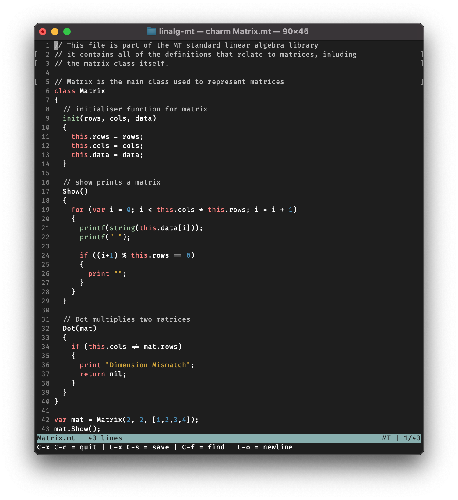

# Charm 
Charm is a light-weight terminal based editor for editing MT (and other) files. It is a command line editor based on the kilo editor by Salvatore Sanfilippo aka antirez.

## Features
* Light-weight design - it's fast
* Easy to use
* Syntax highlighting (see supported for more info)
* Incremental Search

## Usage
Charm takes the best (my favorite) features from vi and Emacs to create a balanced editor experience. There are no modes - just type. The shortcuts to not to be chords however this is needed sometimes. The full list of commands are as follows

- `C-x C-s` Save a File
- `C-x C-c` Quit a File
- `C-s` Search within file
- `C-o` Newline no break (vi `o`)
- `C-c` Change Inner (vi `C`)

## Supported Languages

### Full Support
* C/C++ (including header files)
* MT (see https://www.github.com/ramsaycarslaw/mt)
* Go 
* Text files
* Python

## ToDo
- [ ] Auto-Indent
- [ ] Init File
- [ ] Search & Replace  
